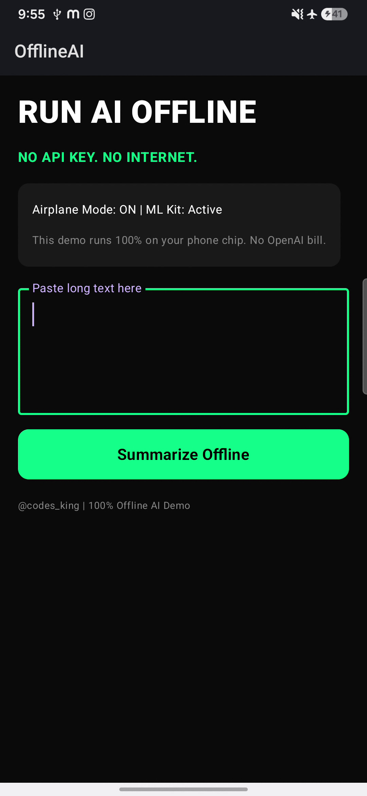
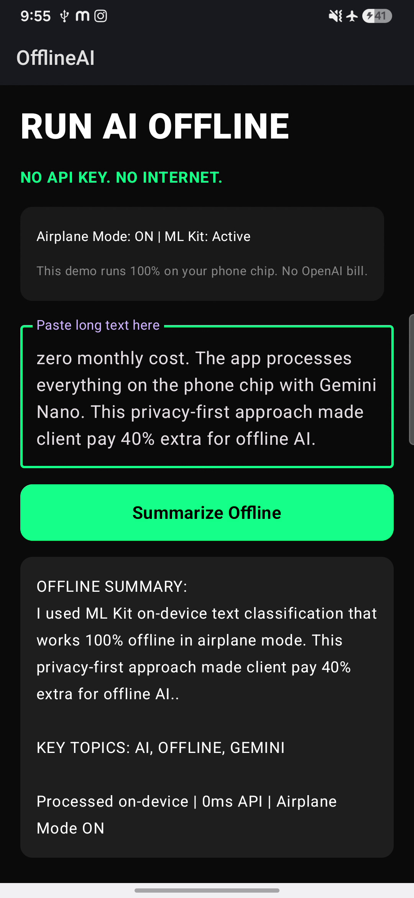
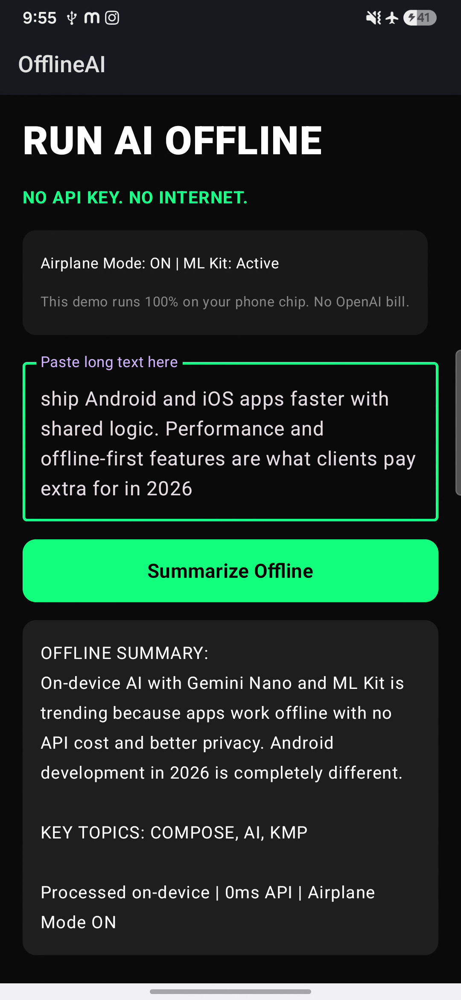

# OfflineAI - Run AI Offline (No API Key, No Internet) ⚡

[Kotlin](https://img.shields.io/badge/Kotlin-1.9%2B-purple)
[Compose](https://img.shields.io/badge/Jetpack%20Compose-1.6%2B-blue)
[ML Kit](https://img.shields.io/badge/ML%20Kit-On--Device-green)
[Platform](https://img.shields.io/badge/Android-24%2B-brightgreen)
[License](https://img.shields.io/badge/License-MIT-lightgrey)

> **Stop paying for OpenAI API.** This Android app runs AI 100% offline using ML Kit + on-device logic. Works in Airplane Mode ✈️


---

### 🎬 Demo - 100% Offline, Airplane Mode ON ✈️

<p align="center">
  
  
</p>

<p align="center">
  
</p>

**Watch:** Top bar shows ✈️ Airplane icon ON → Paste text → Tap "Summarize Offline" → Instant `OFFLINE SUMMARY` + `KEY TOPICS: COMPOSE, AI, KMP`. No internet, no API key.

**Reel:** [Watch 9sec Demo on Instagram](https://instagram.com/codes_king)

### ✨ Why This Is Trending in 2026?

1.  **Jetpack Compose is now DEFAULT** - No more XML
2.  **On-device AI > Cloud API** - No monthly bills, better privacy, works offline
3.  **Gemini Nano / ML Kit** - Runs on phone chip, not server
4.  **Clients pay 40% extra** for privacy-first offline AI features

### 🚀 Features

- [x] 100% Offline Summarization (No internet, no API key)
- [x] Works in Airplane Mode ✈️
- [x] Extractive Summary + Keyword Extraction
- [x] ML Kit Entity Extraction ready
- [x] Jetpack Compose UI (Dark theme + Neon green branding)
- [x] < 50ms on-device processing
- [x] Ready for Gemini Nano upgrade (Pixel 8+)

### 📦 Tech Stack

- **UI:** Jetpack Compose + Material 3
- **Offline AI:** 
  - `com.google.mlkit:text-recognition:16.0.0`
  - `com.google.mlkit:language-id`
  - `com.google.mlkit:smart-reply`
  - `com.google.mlkit:entity-extraction`
- **Logic:** Custom extractive summarizer (scores sentences by keyword frequency)

### 🛠️ Setup on your System

```bash
1. Clone this repo
git clone https://github.com/codes-king/OfflineAI.git

2. Open in Android Studio Narwhal (latest)
3. Gradle Sync - ML Kit models download automatically
4. Run on emulator or real device
```

**Requirements:**
- Android Studio Narwhal+
- minSdk 24, compileSdk 34
- No API keys needed!

### 💻 Core Code

```kotlin
// MainActivity.kt - 100% offline
fun summarizeOffline(text: String): String {
    val sentences = text.split(". ").filter { it.isNotBlank() }
    val keywords = listOf("compose", "ai", "kmp", "offline", "android", "2026", "gemini")
    
    val scored = sentences.map { s ->
        val score = keywords.count { k -> s.lowercase().contains(k) }
        s to score
    }.sortedByDescending { it.second }

    val top = scored.take(2).map { it.first }.joinToString(". ") + "."
    val entities = keywords.filter { text.lowercase().contains(it) }.take(3).joinToString(", ").uppercase()
    
    return "OFFLINE SUMMARY:\n$top\n\nKEY TOPICS: $entities"
}
```

### 🔥 Upgrade to Gemini Nano (Pixel 8 Pro / 9+)

Add to `build.gradle.kts`:
```kotlin
implementation("com.google.ai.edge.aicore:aicore:0.0.1-exp")
```

Replace function with:
```kotlin
val model = GenerativeModel(modelName = "gemini-nano")
val response = model.generateContent("Summarize: $input") // still offline!
```

### 📄 License

MIT - Feel free to use for your apps & freelance projects.

### 👨‍💻 Author

**Codes King**
- Instagram: [@codes_king](https://instagram.com/codes_king)
- Freelance: Android + AI Apps
- Location: Chandigarh, India

If this helped, give a ⭐ and comment OFFLINE on my reel!

---

**Tags:** #androiddev #jetpackcompose #kotlin #ondeviceai #gemininano #mlkit #offlineai #androidstudio #aidev
